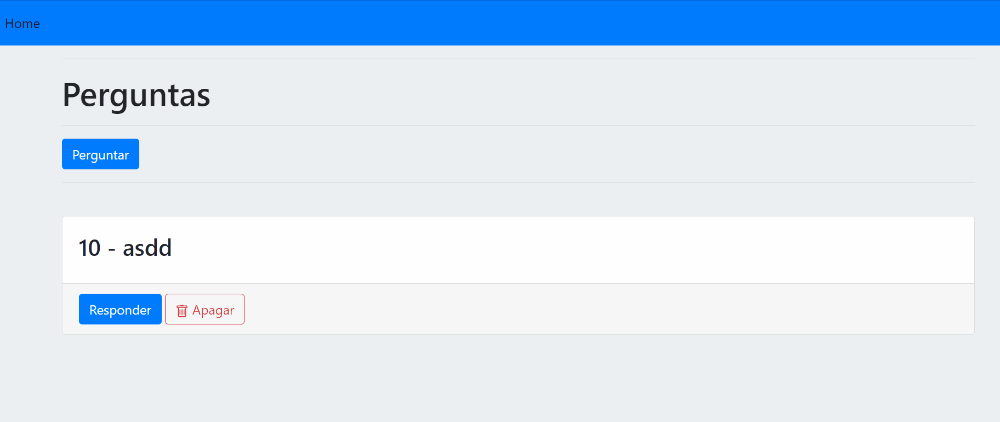

# Projeto iniciante testando libs de ejs com node.js

Crud básico de criação e exclusão de perguntas

## Referência

 - [EJS](https://ejs.co/#docs)
 - [Sequelize](https://sequelize.org/)
 
## Demo: 

## Stack utilizada

  

